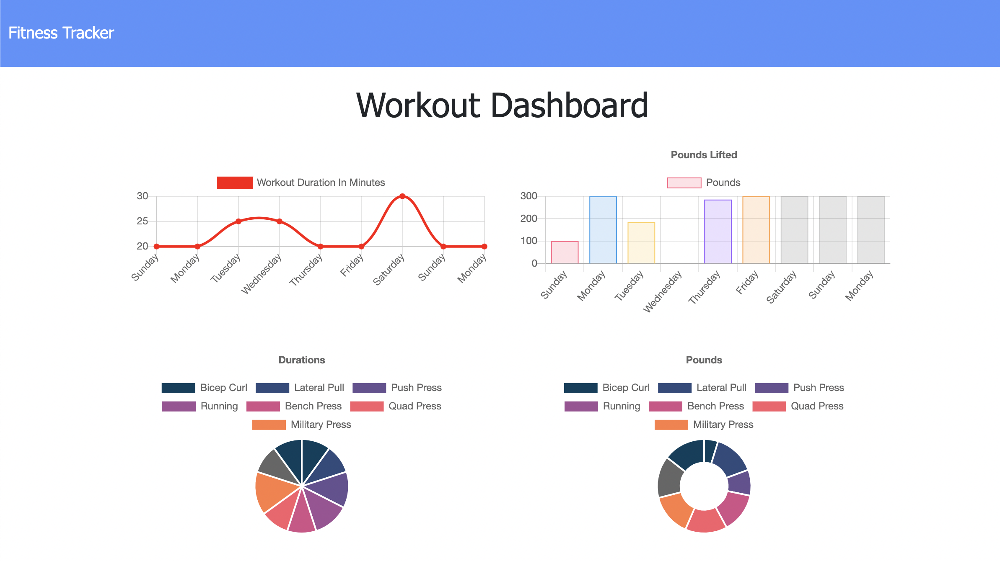

  # FIT

   

  ## Overview
  As a user, I want to be able to view create and track daily workouts. I want to be able to log multiple exercises in a workout on a given day. I should also be able to track the name, type, weight, sets, reps, and duration of the exercise. If the exercise is a cardio exercise, I should be able to track my distance traveled.

  
  

   

  ## Table of Contents
  1. [Installation](#Installation)
  2. [Usage](#Usage)
  3. [Contributing](#Contributing)
  4. [License](#License)
  5. [Questions](#Questions)
  

   

  ## Installation
  To install this project, please do the following: 
  The application is already deployed to [heroku here](https://stephen-fit.herokuapp.com/). Feel free to clone this git repo if you wish to modify the code.
  

   

  ## Usage
  To get started, consider the following: 
  Log exercises to a workout. If you are done with your workout click on complete. The dashboard page displays stats about all workouts.
  

   

  ## Contributing

  ### Accepted Contributions:
  The following contributions are allowed for this project: 
  <ul>
    <li>creating issues</li><li>pull requests</li><li>suggesting enhancements</li><li>reporting bugs</li><li>documentation</li>
  </ul>
   

  ### Guidelines
  To contribute to this project, please abide by the following: 
  Abide by Github's code of conduct.
  

   

  ## License
  This project is licensed under the MIT license.
  For more information refer to this link: 
  

   

  ## Questions
  To communicate with the project owner, use the following contact information: 
  Created by: stephenlprice  
  You can ask me any questions at this address: stellopricint@gmail.com
  